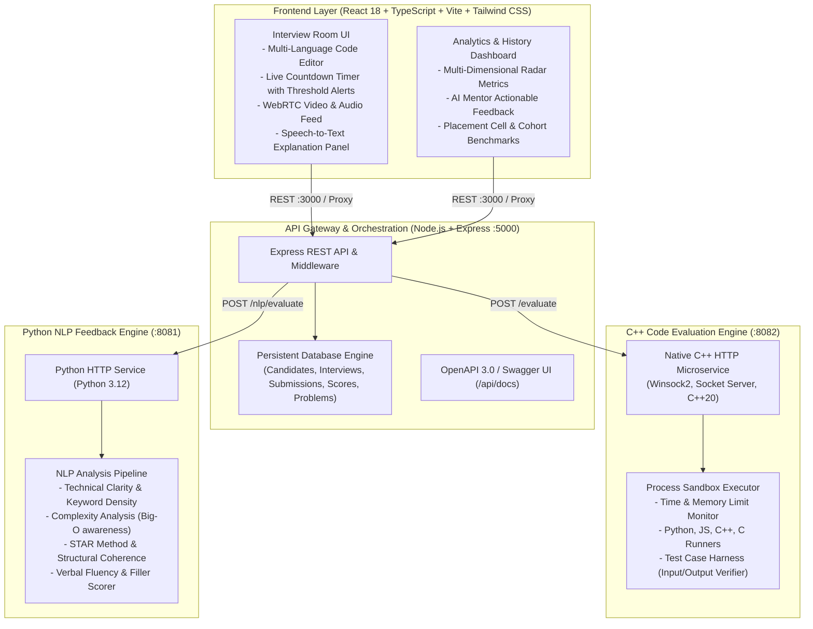

# Smart Interview Simulation & Evaluation Platform

An end-to-end, multi-service technical interview simulation and automated candidate evaluation platform. The system pairs realistic timed interview rooms, a multi-language coding editor, live camera/mic recording with speech explanation, sandboxed test case execution, and NLP-driven communication scoring.

---

## Architecture Diagram



---

## Features

### Core Features (MVP)
- **Realistic Interview Rooms**: Timed technical interview sessions with assigned question sets, difficulty levels, and constraints.
- **Multi-Language Coding Editor**: Syntax-aware code editor supporting Python, JavaScript, C++, and C with auto-indentation, line numbers, and theme customization.
- **Live Countdown Timer**: Real-time timer with progress rings and visual alert thresholds (amber at 5 min, pulsing red at 2 min).
- **Automated Test Evaluation**: Run sample test cases for immediate feedback, or submit solutions against hidden edge cases executed by the C++ engine.

### Advanced Features
- **Performance Analytics & Scorecard**: 0–100 composite candidate score with rating bands (*Strong Hire*, *Hire*, *Practice Recommended*).
- **Communication & Verbal Scoring**: Dedicated Python NLP engine analyzing candidate speech transcripts for algorithmic terminology, Big-O awareness, and structured reasoning.
- **Multi-Dimensional Competencies**: Detailed breakdown across 5 dimensions:
  1. Algorithms & Data Structures
  2. Problem Solving & Strategy
  3. Code Quality & Cleanliness
  4. Verbal Articulation
  5. Speed & Pacing
- **Interview Recording & Replay**: WebRTC video/audio stream capture and archived session replay for placement cells.
- **Progress Tracking & Cohort Leaderboard**: Historical timeline tracking score progression over time, plus an institutional dashboard for Training Institutes and Placement Cells.

---

## Tech Stack

| Layer | Technologies |
|---|---|
| **Frontend** | React 18, TypeScript, Vite, Tailwind CSS, Lucide Icons |
| **API Gateway** | Node.js (v24), Express.js, Swagger UI, ES Modules |
| **Code Evaluation Engine** | C++ (GCC 16 / C++20), Winsock2, Windows Process API / POSIX |
| **NLP Feedback Engine** | Python 3.12, Standard Library HTTP Microservice, Regex NLP Pipelines |
| **Containerization** | Docker, Docker Compose, Multi-stage Nginx |

---

## API Documentation (OpenAPI / Swagger)

Interactive Swagger UI is available at `http://localhost:5000/api/docs`.

### Primary Endpoints

| Method | Endpoint | Description |
|---|---|---|
| `POST` | `/api/interview/start` | Creates a timed interview session, assigns problems, and returns token. |
| `GET` | `/api/interview/:id` | Retrieves current interview session state, submissions, and time left. |
| `POST` | `/api/submission/evaluate` | Dispatches code to C++ Evaluation Engine; evaluates sample and hidden test cases. |
| `POST` | `/api/interview/communication-feedback` | Dispatches explanation transcript to Python NLP engine for real-time scoring. |
| `POST` | `/api/interview/finish` | Concludes interview, compiles multi-language evaluation, and saves scorecard. |
| `GET` | `/api/results/history` | Returns historical interview sessions, candidate analytics, and radar stats. |
| `GET` | `/api/questions` | Lists all questions in problem library with starter code and sample cases. |
| `GET` | `/api/health` | Health check reporting status across Node, C++, and Python services. |

---

## Setup Guide

### Option 1: 1-Click Launch (Native Development on Windows)

1. Make sure **Node.js**, **Python 3.12**, and **g++** are in your PATH.
2. Simply double-click or run:
```bat
start-all.bat
```
This automatically boots all 4 services:
- **Frontend**: `http://localhost:3000`
- **Node.js Gateway**: `http://localhost:5000`
- **Swagger UI**: `http://localhost:5000/api/docs`
- **Python NLP Engine**: `http://localhost:8081`
- **C++ Code Evaluator**: `http://localhost:8082`

---

### Option 2: Manual Step-by-Step Setup

#### 1. Compile C++ Code Evaluation Engine
```bash
cd evaluator-service
g++ -std=c++20 -O2 src/main.cpp -lws2_32 -lpsapi -o evaluator_service.exe
./evaluator_service.exe 8082
```

#### 2. Start Python NLP Feedback Engine
```bash
cd nlp-service
python server.py
```

#### 3. Start Node.js API Gateway
```bash
cd backend
npm install
npm start
```

#### 4. Start React Frontend
```bash
cd frontend
npm install
npm run dev
```

---

### Option 3: Docker Containerized Deployment

```bash
docker-compose up --build
```
Access the application at `http://localhost:3000`.

---

## Live Demo & Screenshots

- **Frontend Application**: `http://localhost:3000`
- **API Documentation & Swagger UI**: `http://localhost:5000/api/docs`
- **Health Diagnostic**: `http://localhost:5000/api/health`

### Key UI Views
1. **Interview Room**: Split layout with markdown problem description on the left, code editor in the center with language switcher (Python, JS, C++, C), tabbed test case runner with actual vs expected diffs, and live candidate webcam with real-time speech analysis.
2. **Evaluation & Scorecard**: 0–100 circular score ring, hire recommendation badge, 4 dimension bars, radar competency breakdown, and AI mentor feedback bullet cards.
3. **Progress & History**: Chronological log of completed sessions with score progressions.
4. **Placement Cells & Recruiters**: Institutional leaderboard, candidate readiness benchmarks, and detailed candidate dossiers.

---

## Performance Notes

- **C++ Execution Engine**: Process sandboxing executes user code in temporary isolated workspaces with strict timeout thresholds (default 3500ms) and peak working set memory measurement. Submissions execute in sub-millisecond to tens-of-milliseconds ranges.
- **Python NLP Pipeline**: Fast lexical and structural pattern matching without heavyweight warm-up overhead, returning structured feedback within 10–25ms.
- **Zero External DB Overhead**: Embedded persistent store ensures instant zero-configuration boot times without requiring external database setups.

---

## Resume Highlights

- **Built end-to-end interview simulation system**: Designed and developed a distributed technical interview platform with timed simulation rooms, code execution consoles, and automated evaluation scorecards.
- **Automated evaluation using multi-language services**: Built a high-performance C++ process sandboxing service for sub-millisecond code execution and a Python NLP microservice for real-time candidate verbal reasoning and Big-O articulation analysis.
- **Architected full-stack distributed system**: Integrated React 18, Node.js API Gateway, C++20 engine, and Python 3.12 services containerized with Docker and documented via OpenAPI 3.0 / Swagger UI.
